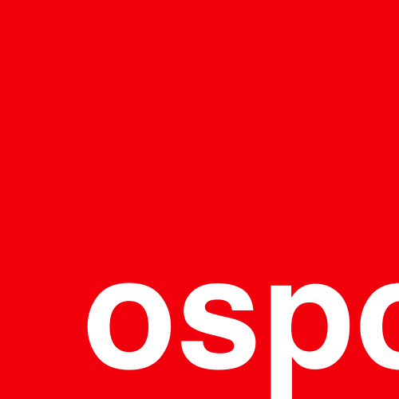
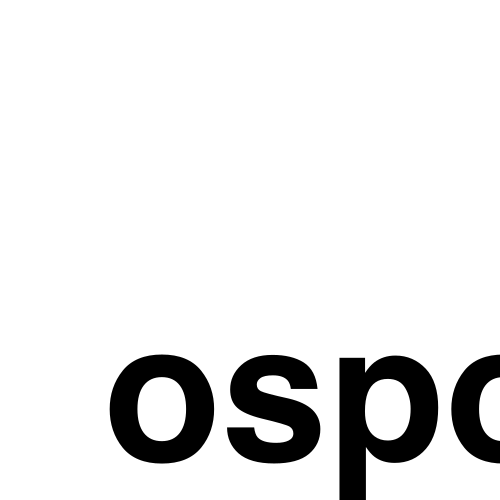
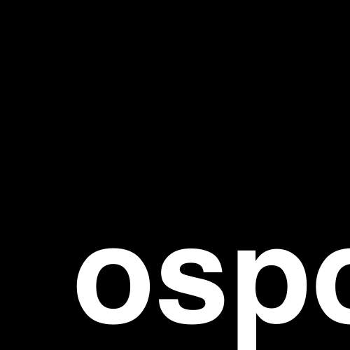

# 🎨 ospo.ch artwork

## Logos

|Variant|Logo|Wordmark|
|---|---|---|
|default|||
|download|[svg](./logos/logo.svg), [png](./logos/logo.png)|[svg](./logos/logo-wordmark.svg), [png](./logos/logo-wordmark.png)|
|black|||
|download|[svg](./logos/logo--black.svg), [png](./logos/logo--black.png)|[svg](./logos/logo-wordmark--black.svg), [png](./logos/logo-wordmark--black.png)|
|white|||
|download|[svg](./logos/logo--white.svg), [png](./logos/logo--white.png)|[svg](./logos/logo-wordmark--white.svg), [png](./logos/logo-wordmark--white.png)|

## Colors 

|COLOR|NAME|HEX|CMYK|RGB|
|---|---|---|---|---|
||Red|`#F2000C`|`0/100/95/5`|`rgb(242,0,12)`|

## Legal

This work is licensed under [Creative Commons Attribution-NonCommercial-ShareAlike 4.0 International](https://creativecommons.org/licenses/by-nc-sa/4.0/)

## Credits

- The ospo.ch logo mark and logo type are designed by [Dimitri Kandassamy](https://github.com/dimitri-kandassamy)
