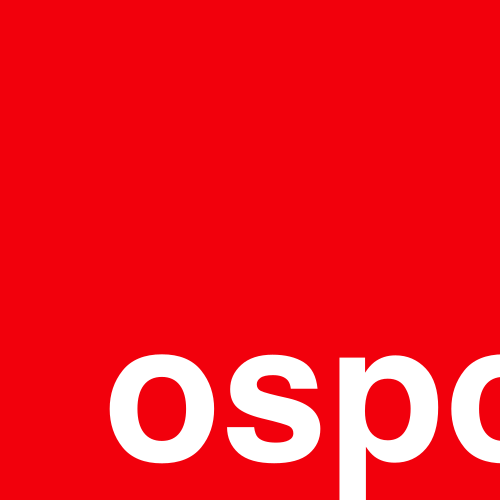
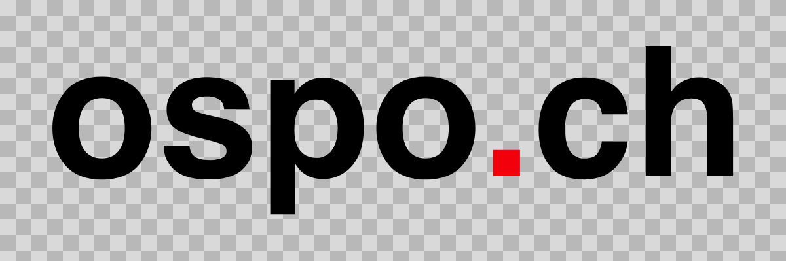
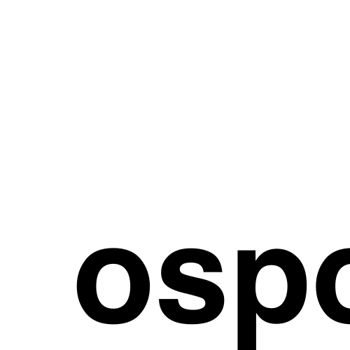
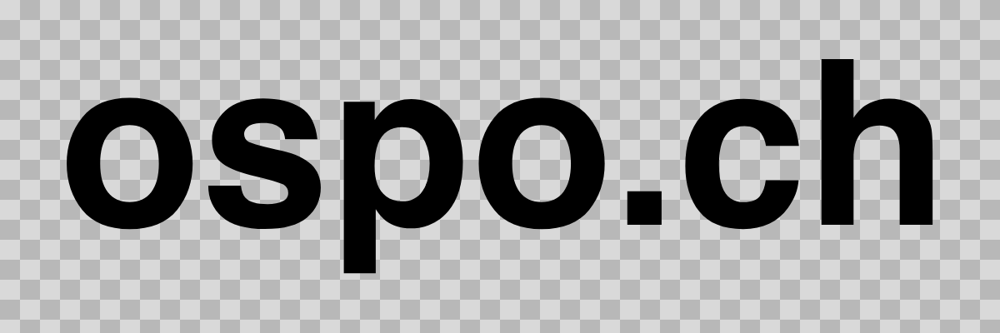
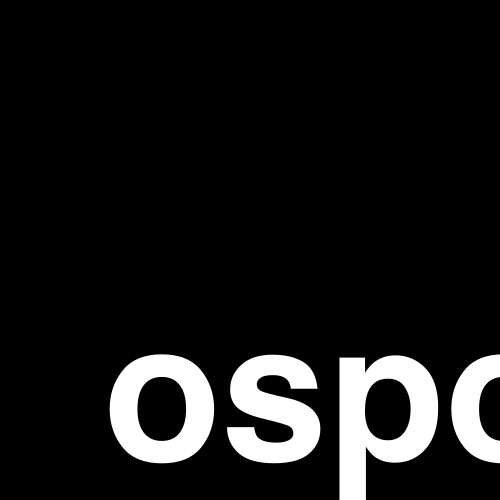
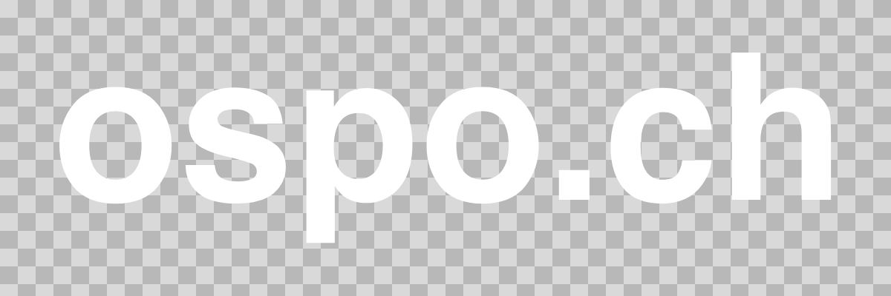
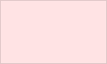
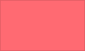
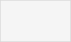
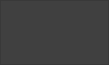

# 🎨 ospo.ch artwork

## Logos

|Variant|Logo|Wordmark|
|---|---|---|
|default|||
|download|[svg](./logos/logo.svg), [png](./logos/logo.png)|[svg](./logos/logo-wordmark.svg), [png](./logos/logo-wordmark.png)|
|black|||
|download|[svg](./logos/logo--black.svg), [png](./logos/logo--black.png)|[svg](./logos/logo-wordmark--black.svg), [png](./logos/logo-wordmark--black.png)|
|white|||
|download|[svg](./logos/logo--white.svg), [png](./logos/logo--white.png)|[svg](./logos/logo-wordmark--white.svg), [png](./logos/logo-wordmark--white.png)|

### Notes

- **The square mark** follows a Swiss-graphic-design intent: the `ospo` lettermark is set in the lower-right of the square, the final `o` is deliberately cropped by the right edge, and the `p` descender sits flush to the bottom border. It is intended as a large, expressive brand mark — for very small or corner-masked contexts (favicons, app icons) prefer the wordmark or add clear space.
- **`--black` / `--white` denote the *ink* (foreground) colour**, not the background. So `--black` is a black mark (on a white field for the square form) and `--white` is a white mark (on a black field). The mono SVGs use `fill="currentColor"`, so when inlined they can be re-coloured with the CSS `color` property; the standalone files and PNGs render with the colour shown above.
- **Clear space & minimum size.** The wordmark assets are tightly cropped with no built-in padding, so the consumer controls spacing — keep clear space of at least the height of the `o` on all sides of the wordmark, and the width of one `o` around the square mark. Don't render the wordmark below ~120px wide or the square below ~24px; at smaller sizes use the [`o` monogram](./icons/favicon.svg).
- **Use the vector (SVG) as the master.** PNGs are provided for convenience at a single size; scale from the SVG for any larger or high-DPI use.

> Wordmark previews above are shown on a checkerboard so the black and white variants stay visible in both light and dark themes; the assets themselves have transparent backgrounds.

## Icons

Favicon, app and PWA icons live in [`icons/`](./icons). They are built from the **`o` monogram** rather than the full square mark, which is illegible at icon sizes.

|Asset|File|Use|
|---|---|---|
|Favicon (SVG)|[favicon.svg](./icons/favicon.svg)|Modern browser tab icon|
|Favicon (ICO)|[favicon.ico](./icons/favicon.ico)|Legacy tab icon (16 / 32 / 48)|
|Apple touch|[apple-touch-icon.png](./icons/apple-touch-icon.png)|iOS home screen (180)|
|PWA|[icon-192.png](./icons/icon-192.png), [icon-512.png](./icons/icon-512.png)|Android / PWA|
|Maskable|[maskable-512.png](./icons/maskable-512.png)|Adaptive / maskable icon (safe-zone aware)|
|Manifest|[site.webmanifest](./icons/site.webmanifest)|PWA manifest|

## Social

[`social/og-image.png`](./social/og-image.png) (1200×630) is the Open Graph / social share image — the white wordmark on the brand-red field. SVG source: [`og-image.svg`](./social/og-image.svg).

## Design tokens

The palette is defined once in [`tokens/tokens.json`](./tokens/tokens.json) (W3C DTCG format) and compiled to [`tokens.css`](./tokens/tokens.css), [`tokens.scss`](./tokens/tokens.scss) and [`tokens.js`](./tokens/tokens.js) (with [`tokens.d.ts`](./tokens/tokens.d.ts) types). Regenerate the outputs, the colour tables below, and the manifest theme colour with:

```sh
node tokens/build.mjs
```

Logo SVGs and PNGs carry literal hex (you don't template artwork at runtime); if the brand colour changes, update `tokens.json` and re-export the affected marks.

## Colors

<!-- BEGIN GENERATED COLORS (node tokens/build.mjs) -->
### Brand red

`color.red.500` is the primary brand colour. The scale provides tints for backgrounds and accessible shades for text.

|Colour|Token|HEX|RGB|Notes|
|---|---|---|---|---|
||`color.red.100`|`#FFE3E4`|`rgb(255, 227, 228)`|Subtle background wash|
||`color.red.300`|`#FF6A72`|`rgb(255, 106, 114)`|Tint / accent on dark|
||`color.red.500`|`#F2000C`|`rgb(242, 0, 12)`|Primary brand. CMYK 0/100/95/5. Large text & UI only on white (4.4:1 — not AA for body text)|
||`color.red.700`|`#B80009`|`rgb(184, 0, 9)`|Accessible red for body text / links on white (6.9:1)|
||`color.red.900`|`#73000A`|`rgb(115, 0, 10)`|Deep red for active / pressed states|

### Neutrals

|Colour|Token|HEX|RGB|Notes|
|---|---|---|---|---|
||`color.grey.100`|`#F5F5F5`|`rgb(245, 245, 245)`|Subtle background|
||`color.grey.300`|`#D4D4D4`|`rgb(212, 212, 212)`|Borders / dividers|
||`color.grey.500`|`#737373`|`rgb(115, 115, 115)`|Lightest grey passing AA body text on white (4.7:1)|
||`color.grey.700`|`#404040`|`rgb(64, 64, 64)`|Secondary text|
||`color.grey.900`|`#171717`|`rgb(23, 23, 23)`|Primary text / ink|
||`color.black`|`#000000`|`rgb(0, 0, 0)`|Mono mark, maximum contrast|
||`color.white`|`#FFFFFF`|`rgb(255, 255, 255)`|Surfaces, reversed mark|

### Semantic tokens

Aliases that map intent to a colour in the scale — prefer these in product code.

|Colour|Token|Resolves to|HEX|Notes|
|---|---|---|---|---|
||`color.brand`|`color.red.500`|`#F2000C`|Primary brand colour|
||`color.text`|`color.grey.900`|`#171717`|Primary text / ink|
||`color.text-secondary`|`color.grey.700`|`#404040`|Secondary text|
||`color.text-link`|`color.red.700`|`#B80009`|Links / red text on white (AA)|
||`color.surface`|`color.white`|`#FFFFFF`|Default background|
||`color.surface-muted`|`color.grey.100`|`#F5F5F5`|Muted background|
||`color.border`|`color.grey.300`|`#D4D4D4`|Borders / dividers|

> Contrast ratios are WCAG 2.1 against white. `color.red.500` meets AA for large text and UI components (≥3:1) but not body text — use `color.text-link` (red 700) for red text on white.
<!-- END GENERATED COLORS -->

## Legal

This work is licensed under [Creative Commons Attribution-NonCommercial-ShareAlike 4.0 International](https://creativecommons.org/licenses/by-nc-sa/4.0/)

## Credits

- The ospo.ch logo mark and logo type are designed by [Dimitri Kandassamy](https://github.com/dimitri-kandassamy)
